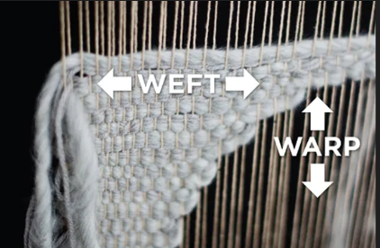
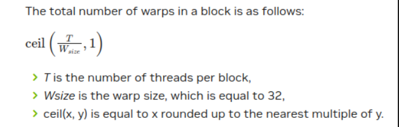

- Host => CPU => Uses Ram sticks on the motherboard
- Device => GPU => Uses on chip VRAM (video memory)

CUDA Program surface level runtime
1. Copy Input from host to device
2. Load GPU program and execute using the transferred on-device data
3. Copy results back from the device back to host.

# Device v/s Host Naming Scheme

- `h_A` refers to host(CPU) for a variable named "A".
- `d_A` refers to device(GPU) for a variable named "A".
- `___global___` is visible globally, meaning that CPU or host can call these global functions. These don't typically return anything but just do really fast computations to their arguments. 
- `__host__` is only going to run on the CPU. same as running a regular C/C++ script on CPI without CUDA.

# Memory Management

- `cudaMalloc()` memory allocation on VRAM only(also called **global** memory).

```cpp
float *d_a,*d_b,*d_c;

cudaMalloc(&d_a,sizeof(float));
cudaMalloc(&d_b,sizeof(float));
cudaMalloc(&d_c,sizeof(float));
```

- `cudaMemcpy` can copy from device to host,host to device and device to device.

- `cudaFree` will free memory on the device.

# `nvcc` Compiler

- Seperates host code from device code.
- Replaces device syntax with regular syntax

-   Host Code
    - Compiled to x86 binary to run on host
-   Device Code
    - Compiled to PTX(Parallel Thread Execution)
    - Stable across multiple GPU generations
-   JIT(Just In Time)
    - PTX into native GPU instructions
    - allows for foward compatibility

# CUDA Hierarchy
    1. Kernel executes in threads
    2. Threads are grouped into Blocks
    3. Blocks are grouped into Grid
    4. Kernel executed as a Grid of Blocks of Threads

# Threads
- Each thread has a local memory (registers) and is private to the thread
- Each Block has a shared memory which is private to all the thread within that block.
- If I want to add two arrays together then each thread would need to add two individual elements of those arrays and store it in the third array.



# Warps

- Each warp is a longitudnal set.
- Each warp in a block parallelizes 32 threads
- Instructions are issued to warps and not threads
- Number of warps depends on the number of threads and Warp Size, which defaults to 32



# Blocks
- Each block has shared memory that is **only visible to all the threads within that block**


- CUDA parallelism is scalable because they aren't run sequentially. Meaning that you may not run Block 0 & Block 1, then Block 2 & Block 3. It can be Block 3 and then Block 0 then Block 2 then Block1. This means that each of these blocks are solving different subsets of the problems independent of others. As long as all pieces are assembled in the right place at the end, it works.
