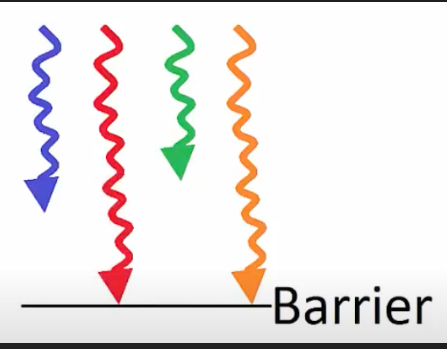

# Kernels

## Kernel Launch Params

- Type `dim3` is 3D type for grids and thread blocks which are later feed into the kernel launch configuration
- allows for indexing of elements as vector, matrix or volume (tensor)

```cpp
dim3 gridDim(4,4,1); // 4 blocks in x, 4 block in y, 1 block in z
dim3 blockDim(4,2,2); // 4 threads in x, 2 threads in y, 2 threads in z
```

- other type is `int` which specifies a 1D vector

```cpp
int gridDim=16; //16 blocks in the grid
int blockDim=32; //32 threads in each block
<<<gridDim,blockDim>>>
//these aren't dim3 types but they are still valid if the indexing scheme is 1D
```

- gridDim => gridDim.x * gridDim.y * gridDim.z = Number of blocks being launched

- blockDim => blockDim.x * blockDim.y * blockDim.z = Number of threads in the block per block

- total threads= (threadsPerBlock)*Number of Blocks

- The execution configuration(of a global function) is specified by inserting an expression of the form <<<gridDim,blockDim, Ns,S>>> where
    - gridDim(dim3) specifies the dimensions and size of the grid
    - blockDim(dim3) specifies the dimensions and size of each block
    - Ns(size_t) specifies the number of Bytes in shared memory that is    
      dynamically allocates per block for this call in addition to the statistically allocated memory.
    - S(cudaStream_t) specifies the associated stream, this is an optional parameter that defaults to 0

# Thread Synchronization

- `cudaDeviceSynchronize()` => makes sure all the kernel for one problem are caught up so you can safely begin the next. Think of this like a barrier for flow of control, Remember that this is only called from `int main()` or some other non `__global__` function.

-  `__syncthreads()`=> to put a barrier for thread execution inside the kernel, useful if you are messing with the same shared memory that all the threads within the block are trying to access.

-  `__syncwarps()` => sync all threads up using a warp.
    - Why do we need synchronized threads()
        Because threads are asynchronous and can be executed in anyorder. If you have a thread that is dependent on another thread, you would need to make sure that the thread is dependent on the other thread is not executed before the other thread is done.

- For example, if we want to vector add the two arrays `a=[1,2,3,4]` `b=[5,6,7,8] ` and store the result in c,then add 1 to each element  in c, we need to ensure all the addition operations catch up before we move onto addition. If we don't sync threads here, there is a possibility that we may get an incorrect output vector where a 1 is added beforehand.



# Thread Safety 

- Is CUDA Thread-Safe?
- When a piece of code that is `thread-safe` it can be run by multiple threads at the same time without leading to race conditions or other unexpected behaviors

- race conditions are where one thread starts the next task before another finished, to prevent race conditionsm we use a special function called `cudaDeviceSynchronize()` to ensure all ***threads throughout all blocks*** are caught up before giving them a new instruction to work on.

# SIMD/SIMT (Single Instruction/Multiple Threads)

- Instead of running the for loop sequentially,each thread can run a single iteration of the for loop so that it appears to only take the time of one iteration. It can grow linearly if you add more and more iterations as you would expect.

- It is simpler than CPU
    - In order instruction Issue.
    - No Branch Prediciton
    - Significantly less control than CPU architecture gives us.

- There is a limit to the number of threads per block, since all threads of a block are expected to reside on the same streaming multiprocessor core and must share the same limited memory resources of that core. On current GPU's a thread block may contain upto 1024 threads per block, 32 threads per warp and 32 warps per block.`(32threads * 32 warps= 1024 threads)`.

- You can also host designated operationslike `log()` on host instead of `logf()` on device but they will run slower. You can also pass `use_fast_math` to the nvcc compiler to convert to these device only ops at the cost of barely noticeable precision error and `--fmad=true` for fused multiply-add.