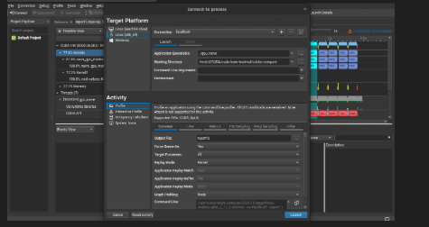

# How to Profile your CUDA kernels

1. 
```bash
nvcc -o 00 00\nvtx_matmux.cu -lnvToolsExt
nsys profile -stats=true ./00
```

> For the following too, you would need to open `ncu` on Linux and drag and drop the .nsys-rep file into the left sidebar
> the .sqlite file can be plugged directly into sqlite DBs for a more customized analysis
2.

```bash
nvcc -o 01 01_naive_matmul.cu 
nsys profile --stats=true ./01
```
3.
```bash
nvcc -o 02 02_tiled_matmul.cu
nsys profile --stats=true ./02
```

## CLI Tools
- Some cli tools that help in visualizing GPU resource usage & utilization
- `nvitop`
- `nvidia-smi` or `watch -n 0.1 nvidia-smi`

# Nsight systems & compute
- nvprof is deprecated so we will be using `nsys` and `ncu` instead
- Nsight systems & compute => `nsys profile --stats=true ./main`



- Unless you have a specific profiling goal, the suggested profiling strategy is starting with Nsight Systems to determine the systems bottlenecks and identifying kernels that affect performance the most. On a second step you can use Nsight compute to profile the identified kernels and find ways to optimize them

- If you aleady have the `.nsys-rep` file, run `nsys stats file.nsys-rep` for a more quantitative profile for `.sqlite` run `nsys analyze file.sqlite` to give a more qualitative profile.

- To see a detailed GUI of this, we can run `nsight-sys` => file => open => rep file

- `nsys` nsight systems is a higher level; `ncu` nsight compute is lower level

- generating profiling files for pytohn script `nsys profile --stats=true -o mlp python mpl.py`

- to profile w/ nsight systems GUI, find the kernels that you would need to optmizie, open in even view, zoom to selected on timeline and analyze kernel w/ ncu by right clicking on the timeline.

- ncu may deny permissions => `code /etc/modprobe.d/nvidia.conf` and force change `nvidia.conf` by adding the line `options nvidia NVreg_RestrictProfilingToAdminUsers=0` then restarting your machine.

- `compute-sanitizer ./main` for memory leaks
- kernel performance UI => ncu-ui (`sudo apt installl libxcb-cursor0`)

# Kernel Profiling

- [Nsight Compute Kernel Profiling](https://docs.nvidia.com/nsight-compute/ProfilingGuide/index.html)

- `ncu --kernel-name matrixMulKernelOptimized --launch-skip 0 --launch-count 1 --sectionOccupancy "./nvtx_matmul"`
- turns out nvidia profiling tools won't give you everything you need to optimize deep learning kernels

# `nvtx` profiling

```bash
# Compile the code
nvcc -o matmul matmul.cu -lnvToolsExt

#Run the program with Nsight Systems
nsys profile --stats=true ./matmul
```

- `nsys stats report.qdrep` to see the stats

# CUPTI

- This tool allows you to build your own profiler tools
- The CUDA Profiling Tools Interface (CUPTI) enables the creation of profiling and tracing tools that target CUDA applications.
- CUPTI provides the following API's:
    - Activity API
    - Callback API
    - Event API
    - Metric API
    - Profiling API
    - PC Sampling API
    - SASS Metric API
    - Checkpoint API
- Using these APIs you can develop your own profiling tools that give insight into the CPU and GPU behavior of CUDA applications. CUPTI is delivered as a dynamix library on all platforms supported by CUDA.
- CUPTI has a steeper learning curve to follow

Running nsys prints an output like this which can be used futher to detect bottlenecks and optimize code
- It will also save a .sqlite file  of the report 


