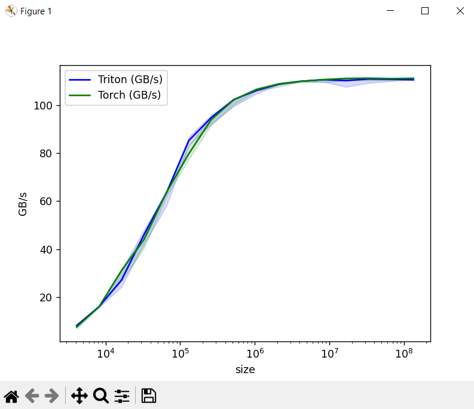

# Triton

## Design

- CUDA -> Scalar Program + Blocked Threads
- Triton -> Blocked Program + Scalar Threads

- Blocked Program + Scalar Threads (Triton) v/s Scalar Program + Blocked Threads(CUDA)
    - CUDA is a scalar program with blocked threads because we write a kernel to operate at the level of threads(scalar), whereas triton is abstracted up to thread blocks (compiler takes care of thread level opeartions).
    - CUDA has blocked threads in the context of "worrying" about inter-thread at the level of blocks, whereas triton has scalar threads in the context of "not worrying" about inter-thread at the level of threads(compiler takes care of this).

## But what does this actually mean?

- A higher level of abstraction for deep learning operations.
- The compiler takes care of the boilerplate complexities of load and store instructions, tiling, SRAM caching etc.
- Python programmers can write kernels comparable to cuBLAS,cuDNN 

- Technically we cannot skip CUDA and go straight to CUDA because the important concepts of CUDA are building blocks for Triton.

- Triton is an abstraction based on topof CUDA
- You may want to optimize your own kernels in CUDA
- Need to understand the paradigms used in CUDA and related topics to understand how to build on top of triton

# Output from 01_vec_add.py

